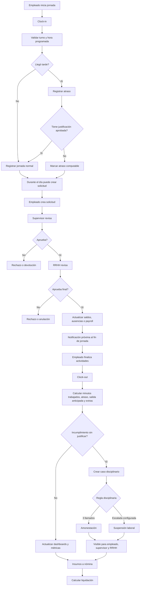

# Nexora — Plan del Core de Recursos Humanos v1

## Resumen
- **Archivo objetivo:** `C:\Users\Hernan Ricardo\Documents\GitHub\Nexora\Nexora\plan\nexora-human-resources-core-plan.md`
- El core de RRHH será un **core complementario y transversal**: autónomo, pero integrado con `garage_operations`, `dental_core` y futuros cores.
- **Decisión principal:** la tabla actual `employees` deja de pertenecer conceptualmente a Taller y pasa a ser el **maestro laboral compartido** del tenant.
- El plan incluye desde el inicio:
  - empleados y perfil laboral,
  - solicitudes y aprobaciones,
  - vacaciones/licencias/ausencias,
  - dashboards por actor,
  - control de ingreso/salida y jornada,
  - deducciones por atrasos sin justificación,
  - llamados de atención, amonestaciones y suspensiones,
  - nómina, liquidaciones, comisiones, productividad.
- **Regla crítica:** todo se diseña como **global configurable**, sin quemar legislación ni reglas disciplinarias fijas.
- **Restricción de hosting:** compatible con Bluehost/cPanel/phpPgAdmin; sin depender de workers persistentes.

## Cambios de dominio, tablas y permisos

### 1) Evolución del maestro `employees`
Reutilizar `employees` y ampliarla como base del dominio RRHH.

**Campos nuevos sugeridos en `employees`:**
- `employee_code`
- `tenant_id`
- `user_id`
- `work_email`
- `personal_email`
- `mobile_phone`
- `birth_date`
- `hire_date`
- `termination_date`
- `employment_status` (`draft`, `active`, `inactive`, `on_leave`, `terminated`, `suspended`)
- `employment_type` (`full_time`, `part_time`, `contractor`, `intern`, `temporary`)
- `department_id`
- `position_id`
- `supervisor_employee_id`
- `cost_center_id`
- `work_shift_id`
- `base_currency`
- `base_salary_amount`
- `salary_mode` (`fixed`, `hourly`, `mixed`)
- `vacation_policy_id`
- `payroll_profile_id`
- `commission_profile_id`
- `discipline_profile_id`
- `privacy_level`
- `created_by`
- `updated_by`

### 2) Tablas nuevas del core RRHH

#### Organización
- `hr_departments`
- `hr_positions`
- `hr_cost_centers`
- `hr_work_shifts`

#### Datos sensibles y perfil completo
- `hr_employee_private_profiles`
- `hr_employee_documents`
- `hr_employee_job_history`

#### Solicitudes y aprobaciones
- `hr_request_types`
- `hr_requests`
- `hr_request_attachments`
- `hr_request_approvals`
- `hr_request_status_history`
- `hr_approval_workflows`
- `hr_approval_workflow_steps`

#### Vacaciones y ausencias
- `hr_leave_policies`
- `hr_leave_policy_rules`
- `hr_leave_balances`
- `hr_leave_movements`
- `hr_absence_incidents`

#### Control de ingreso, jornada y asistencia
- `hr_attendance_policies`
  - `code`, `name`, `late_tolerance_minutes`, `early_exit_tolerance_minutes`, `requires_clock_in`, `requires_clock_out`, `auto_close_day_mode`, `deduction_mode`, `status`
- `hr_shift_assignments`
  - `employee_id`, `work_shift_id`, `attendance_policy_id`, `effective_from`, `effective_to`
- `hr_attendance_records`
  - `employee_id`, `work_date`, `scheduled_start_at`, `scheduled_end_at`, `clock_in_at`, `clock_out_at`, `worked_minutes`, `late_minutes`, `early_exit_minutes`, `overtime_minutes`, `attendance_status`, `justification_status`, `linked_request_id`
- `hr_attendance_events`
  - `attendance_record_id`, `event_type` (`clock_in`, `clock_out`, `manual_adjustment`, `notification_sent`, `auto_close`), `event_at`, `created_by`, `notes`
- `hr_attendance_justifications`
  - `attendance_record_id`, `employee_id`, `reason`, `attachment_url`, `decision_status`, `reviewed_by`, `reviewed_at`
- `hr_attendance_notifications`
  - `employee_id`, `attendance_record_id`, `notification_type` (`shift_end_reminder`, `missing_clock_out`, `late_alert`), `scheduled_for`, `sent_at`, `status`

**Reglas**
- El empleado marca **inicio** y **fin** de jornada.
- El sistema avisa cuando se aproxima el fin de la jornada.
- Si entra tarde sin justificación aprobada, se registra atraso computable.
- Esos minutos/horas alimentan métricas y, si aplica, inputs de nómina/deducción.

#### Disciplina, llamados de atención y sanciones
- `hr_discipline_profiles`
  - `code`, `name`, `status`
- `hr_discipline_rules`
  - `discipline_profile_id`, `rule_type`, `threshold_value`, `action_type`, `action_config_json`, `effective_from`
- `hr_disciplinary_cases`
  - `employee_id`, `source_type` (`lateness`, `absence`, `misconduct`, `manual`), `source_id`, `case_date`, `severity`, `description`, `status`
- `hr_warning_notices`
  - `employee_id`, `disciplinary_case_id`, `warning_level`, `issued_at`, `issued_by`, `acknowledged_at`, `status`
- `hr_reprimands`
  - `employee_id`, `origin_warning_id`, `issued_at`, `issued_by`, `reason`, `status`
- `hr_suspensions`
  - `employee_id`, `origin_reprimand_id`, `start_date`, `end_date`, `days_count`, `salary_impact_mode`, `notes`, `status`
- `hr_discipline_history`
  - `employee_id`, `event_type`, `event_id`, `event_date`, `points_delta`, `notes`

**Configuración inicial deseada**
- 3 llamados de atención ⇒ 1 amonestación
- 2 amonestaciones ⇒ en la tercera ocurrencia disciplinaria, suspensión laboral configurable

**Importante**
- Esto debe vivir como **regla configurable**, no hardcode.

#### Nómina y liquidaciones
- `hr_payroll_profiles`
- `hr_payroll_concepts`
- `hr_payroll_periods`
- `hr_payroll_runs`
- `hr_payroll_run_employees`
- `hr_payroll_run_items`
- `hr_payslips`

#### Comisiones y productividad
- `hr_commission_profiles`
- `hr_commission_rules`
- `hr_commission_events`
- `hr_commission_calculations`
- `hr_productivity_snapshots`

### 3) Reglas de privacidad y visibilidad
**Transacciones nuevas sugeridas:**
- `hr_dashboard_employee`
- `hr_dashboard_supervisor`
- `hr_dashboard_hr`
- `hr_employees`
- `hr_employee_profile`
- `hr_employee_private`
- `hr_requests`
- `hr_request_approvals`
- `hr_attendance`
- `hr_attendance_review`
- `hr_discipline`
- `hr_leave_policies`
- `hr_payroll`
- `hr_payslips`
- `hr_commissions`
- `hr_reports`

**Visibilidad**
- Empleado: ve lo propio, incluidos asistencia, llamados y sanciones.
- Supervisor: ve subordinados, cola de aprobación, atrasos y disciplina operativa.
- RRHH: ve global, sensibles, nómina, reglas y sanciones formales.

## Integración, APIs y flujo

### 1) Integración transversal
- `garage_operations` y `dental_core` referencian `employee_id`.
- RRHH absorbe:
  - asistencia,
  - solicitudes,
  - disciplina,
  - nómina,
  - comisiones finales.
- Productividad y comisiones pueden venir de eventos de negocio.
- Atrasos, ausencias y suspensiones deben poder impactar nómina.

### 2) Endpoints sugeridos
**Asistencia**
- `GET /hr/attendance/me`
- `POST /hr/attendance/clock-in`
- `POST /hr/attendance/clock-out`
- `GET /hr/attendance`
- `GET /hr/attendance/:id`
- `POST /hr/attendance/:id/justify`
- `POST /hr/attendance/:id/review-justification`

**Disciplina**
- `GET /hr/discipline/me`
- `GET /hr/discipline/cases`
- `POST /hr/discipline/cases`
- `POST /hr/discipline/warnings`
- `POST /hr/discipline/reprimands`
- `POST /hr/discipline/suspensions`
- `GET /hr/discipline/:employeeId/history`

**Solicitudes**
- `GET /hr/requests`
- `POST /hr/requests`
- `POST /hr/requests/:id/approve`
- `POST /hr/requests/:id/reject`
- `POST /hr/requests/:id/annul`
- `GET /hr/requests/:id/print`

**Nómina**
- `POST /hr/payroll/runs/:id/calculate`
- `POST /hr/payroll/runs/:id/close`
- `GET /hr/payslips/:id`

### 3) Flowchart principal actualizado

### 4) Pantallas mínimas obligatorias
- **Lista de empleados**
- **Perfil integral del empleado**
- **Dashboard empleado**
- **Dashboard supervisor**
- **Dashboard RRHH**
- **Ventana de control de ingreso/salida**
- **Historial de asistencia**
- **Bandeja de justificaciones**
- **Bandeja disciplinaria**
- **Histórico de solicitudes**
- **Gestión de nómina**
- **Liquidaciones**
- **Gestión de comisiones**
- **Configuración de reglas de vacaciones, asistencia, payroll y disciplina**

### 5) UX clave
- Clock-in/clock-out simple, visible y rápido.
- Recordatorio de cierre de jornada antes de hora fin.
- Si falta clock-out, permitir cierre manual controlado por RRHH/supervisor.
- El empleado debe ver:
  - sus atrasos,
  - faltas,
  - llamados,
  - amonestaciones,
  - suspensiones,
  - estado de reconocimiento/acuse.

## Pruebas y criterios de aceptación

### Casos críticos nuevos
- marcar ingreso dentro del horario
- marcar ingreso con atraso
- atraso con justificación aprobada
- atraso sin justificación con impacto computable
- notificación previa al fin de jornada
- marcar salida correctamente
- jornada sin salida registrada
- cierre manual por RRHH
- 3 llamados de atención generan amonestación
- 2 amonestaciones más nueva reincidencia disparan suspensión según regla
- sanción visible para empleado
- suspensión impacta nómina si la regla lo define

### Criterios de aceptación
- El sistema calcula inicio/fin de jornada por empleado y turno.
- El atraso injustificado queda trazado y puede impactar salario.
- Las reglas disciplinarias son configurables por perfil.
- El empleado puede consultar su historial disciplinario.
- Supervisor y RRHH pueden revisar, emitir y escalar medidas.
- Nómina puede consumir atrasos, ausencias y suspensiones.
- No hay exposición indebida de datos sensibles.

## Supuestos y defaults cerrados
- Nombre técnico sugerido: **`human_resources`**
- `employees` se conserva y evoluciona.
- Asistencia y disciplina forman parte del MVP del core.
- El recordatorio de fin de jornada puede resolverse con registro programado y despacho on-demand compatible con el stack actual.
- La política inicial disciplinaria se carga por seed, pero editable:
  - 3 warnings → 1 reprimand
  - recurrencia posterior configurable → suspension
- Las deducciones salariales por atraso dependen de política/justificación, no de una regla fija universal.

## Key Learnings:

1. El control de ingreso/salida NO es accesorio: en este core pasa a ser fuente primaria para métricas, disciplina y deducciones de nómina.
2. La escalera disciplinaria tiene que modelarse como motor de reglas, porque si la dejás hardcodeada después no vas a poder adaptarla por empresa.
3. La visibilidad de llamados, amonestaciones y suspensiones debe existir también para el empleado; si no, perdés trazabilidad formal y defensa administrativa.
