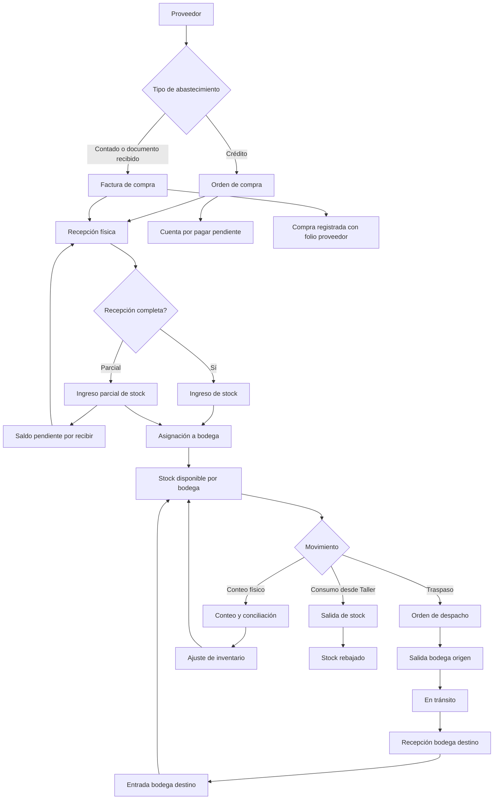

# Nexora — Plan detallado del Core de Inventario v1

## Resumen
- El core de inventario será un **core complementario** que reutiliza la tabla actual **`{schema}.products`**.
- El flujo correcto separa:
  - **documento comercial**: orden de compra / factura de compra
  - **movimiento físico**: recepción, traslado, ajuste, consumo
- Taller seguirá funcionando solo; pero si **Taller + Inventario** están activos en el mismo tenant, Taller debe pasar a consumir el motor de inventario.
- La numeración debe usar **correlativo interno por tipo documental** y además soportar **folio externo del proveedor** cuando aplique.

## Flujo validado

## Cambios de dominio, BD e interfaces

### 1) Reutilización de tabla existente `products`
La tabla actual de Taller ya existe en:
- `C:\Users\Hernan Ricardo\Documents\GitHub\Nexora\Nexora\Database\04_migrations\14_garage_operations_module.sql`
- y hoy contiene base mínima:
  - `id`
  - `sku`
  - `name`
  - `normalized_name`
  - `description`
  - `product_type`
  - `unit`
  - `reference_price`
  - `currency`
  - `status`
  - `created_at`
  - `updated_at`

### 2) Evolución propuesta de `products`
No duplicar producto. Extender `products` con capacidad de inventario.

**Agregar a `products`:**
- `inventory_enabled BOOLEAN DEFAULT FALSE`
- `track_serial BOOLEAN DEFAULT FALSE`
- `track_batch BOOLEAN DEFAULT FALSE`
- `allow_negative_stock BOOLEAN DEFAULT FALSE`
- `reorder_point NUMERIC(12,2) DEFAULT 0`
- `max_stock NUMERIC(12,2) NULL`
- `preferred_supplier_id INTEGER NULL`
- `purchase_unit VARCHAR(30) NULL`
- `sale_unit VARCHAR(30) NULL`
- `conversion_factor NUMERIC(12,4) DEFAULT 1`
- `average_cost NUMERIC(14,4) DEFAULT 0`
- `last_purchase_cost NUMERIC(14,4) DEFAULT 0`
- `requires_expiration BOOLEAN DEFAULT FALSE`
- `storage_notes TEXT NULL`

**Regla**
- `products` sigue siendo maestro compartido.
- Inventario solo opera sobre productos con `inventory_enabled = true`.

### 3) Nuevas tablas del core de inventario

#### `suppliers`
Proveedor maestro.
- `id`
- `name`
- `normalized_name`
- `document_type`
- `document_number`
- `phone`
- `mobile`
- `email`
- `country`
- `region_state`
- `city`
- `commune_district`
- `address`
- `contact_name`
- `payment_term_days INTEGER DEFAULT 0`
- `notes`
- `status`
- `created_at`
- `updated_at`

#### `warehouses`
Bodegas / almacenes / tiendas físicas.
- `id`
- `code`
- `name`
- `warehouse_type` (`main`, `store`, `transit`, `external`)
- `country`
- `region_state`
- `city`
- `commune_district`
- `address`
- `manager_name`
- `phone`
- `notes`
- `status`
- `created_at`
- `updated_at`

#### `document_sequences`
Correlativos internos por tenant y tipo documental.
- `id`
- `document_type` (`purchase_order`, `purchase_invoice`, `dispatch_order`, `stock_count`)
- `prefix`
- `current_number`
- `padding`
- `reset_policy` (`yearly`, `never`)
- `status`
- `created_at`
- `updated_at`

#### `purchase_documents`
Cabecera de orden/factura de compra.
- `id`
- `document_type` (`purchase_order`, `purchase_invoice`)
- `internal_number`
- `supplier_document_number` NULL
- `supplier_id`
- `issue_date`
- `expected_reception_date` NULL
- `due_date` NULL
- `payment_condition` (`cash`, `credit`)
- `payment_term_days`
- `currency`
- `subtotal`
- `discount_total`
- `tax_total`
- `total`
- `status` (`draft`, `issued`, `partially_received`, `received`, `cancelled`)
- `notes`
- `created_by`
- `created_at`
- `updated_at`

#### `purchase_document_lines`
Detalle de compra.
- `id`
- `purchase_document_id`
- `product_id`
- `product_name_snapshot`
- `sku_snapshot`
- `quantity`
- `received_quantity DEFAULT 0`
- `pending_quantity`
- `unit`
- `unit_cost`
- `discount_percent`
- `tax_percent`
- `line_total`
- `notes`

#### `stock_receipts`
Recepción física.
- `id`
- `receipt_number`
- `purchase_document_id`
- `warehouse_id`
- `reception_date`
- `supplier_id`
- `status` (`draft`, `confirmed`, `cancelled`)
- `notes`
- `created_by`
- `created_at`

#### `stock_receipt_lines`
- `id`
- `stock_receipt_id`
- `purchase_document_line_id`
- `product_id`
- `quantity_received`
- `unit_cost`
- `unit`
- `batch_number` NULL
- `serial_number` NULL
- `expiration_date` NULL

#### `stock_movements`
Ledger único de inventario.
- `id`
- `movement_type` (`receipt`, `transfer_out`, `transfer_in`, `adjustment_in`, `adjustment_out`, `consumption`, `reversal`)
- `product_id`
- `warehouse_id`
- `related_warehouse_id` NULL
- `reference_table`
- `reference_id`
- `reference_number`
- `quantity`
- `unit_cost`
- `total_cost`
- `movement_date`
- `signed_quantity`
- `notes`
- `created_by`
- `created_at`

#### `dispatch_orders`
Traspasos entre bodegas.
- `id`
- `internal_number`
- `source_warehouse_id`
- `target_warehouse_id`
- `dispatch_date`
- `expected_arrival_date` NULL
- `status` (`draft`, `dispatched`, `in_transit`, `received`, `cancelled`)
- `carrier_name` NULL
- `driver_name` NULL
- `vehicle_plate` NULL
- `notes`
- `created_by`
- `created_at`
- `updated_at`

#### `dispatch_order_lines`
- `id`
- `dispatch_order_id`
- `product_id`
- `product_name_snapshot`
- `quantity`
- `received_quantity DEFAULT 0`
- `unit`
- `notes`

#### `stock_counts`
Cabecera de inventario físico.
- `id`
- `internal_number`
- `warehouse_id`
- `count_date`
- `status` (`draft`, `counted`, `reconciled`, `cancelled`)
- `notes`
- `created_by`
- `created_at`

#### `stock_count_lines`
- `id`
- `stock_count_id`
- `product_id`
- `system_quantity`
- `counted_quantity`
- `difference_quantity`
- `unit`
- `adjustment_reason` NULL

## Formularios y datos a recopilar

### 1) Formulario de producto
**Objetivo:** alta rápida, pero preparado para inventario real.

**Secciones**
- Identificación
  - nombre
  - sku
  - tipo de producto
  - descripción
  - estado
- Unidad y costos
  - unidad base
  - unidad compra
  - unidad venta
  - factor conversión
  - costo referencia
  - último costo
  - moneda
- Control inventario
  - controla inventario
  - permite stock negativo
  - punto de reposición
  - stock máximo
  - maneja lote
  - maneja serie
  - requiere vencimiento
- Abastecimiento
  - proveedor preferido
  - notas de almacenamiento

**UX recomendada**
- **NO** dejarlo como modal chico.
- Mejor opción: **pantalla dedicada o slide panel grande con secciones colapsables**.
- Alta rápida simple + “configuración avanzada” desplegable.
- Razón: el producto dejó de ser un catálogo chico y pasa a ser un **maestro operativo**.

### 2) Formulario de proveedor
- razón/nombre
- tipo y número documento
- contacto
- email / teléfono
- dirección
- plazo de pago
- notas
- estado

### 3) Formulario de bodega
- código
- nombre
- tipo de bodega
- ubicación
- responsable
- observaciones
- estado

### 4) Formulario de orden de compra
**Cabecera**
- correlativo interno
- proveedor
- fecha emisión
- fecha esperada recepción
- condición pago
- días crédito
- moneda
- observaciones

**Detalle**
- producto
- cantidad
- unidad
- costo unitario
- descuento
- impuesto
- total línea

**Datos derivados**
- subtotal
- impuestos
- total
- pendiente por recibir

### 5) Formulario de factura de compra
Igual a orden de compra, pero agrega:
- folio/documento externo proveedor
- fecha documento proveedor
- vencimiento
- referencia a orden de compra opcional

### 6) Formulario de recepción
- número recepción
- documento origen
- proveedor
- bodega destino
- fecha recepción
- observaciones

**Detalle**
- producto
- cantidad recibida
- costo real
- lote/serie si aplica
- vencimiento si aplica

### 7) Formulario de orden de despacho
- correlativo interno
- bodega origen
- bodega destino
- fecha despacho
- llegada estimada
- transportista / conductor / patente
- observaciones

**Detalle**
- producto
- cantidad
- unidad

### 8) Formulario de conteo físico
- correlativo
- bodega
- fecha
- responsable
- observaciones

**Detalle**
- producto
- stock sistema
- stock contado
- diferencia
- motivo ajuste

## Frontend recomendado

### Patrón base Nexora observado
Hoy Nexora usa:
- `view -> store -> service -> controller`
- vistas Vue por módulo
- `Pinia`
- `NxrSlidePanel`
- formularios modales/slide panel en Taller

Referencias verificadas:
- `C:\Users\Hernan Ricardo\Documents\GitHub\Nexora\Nexora\FrontEnd\Portal\src\views\garage\screens_garage_products.vue`
- `C:\Users\Hernan Ricardo\Documents\GitHub\Nexora\Nexora\FrontEnd\Portal\src\widgets\widgets_garage_work_order_form_modal.vue`
- `C:\Users\Hernan Ricardo\Documents\GitHub\Nexora\Nexora\BackEnd\controllers\garage\workOrdersController.js`

### Decisión UX
#### Para producto
- lista + filtros
- botón “Nuevo producto”
- abrir **panel lateral size `lg/xl`**
- pestañas:
  - General
  - Inventario
  - Abastecimiento

#### Para documentos operativos
- **NO modal pequeño**
- usar **pantallas completas master-detail**
- cabecera fija arriba
- detalle editable en grilla abajo
- totales laterales o footer sticky

#### Para recepción / despacho / conteo
- flujo tipo documento:
  - cabecera
  - grilla de líneas
  - acciones de confirmar / imprimir

#### Para carga de productos
La mejor opción v1 es **doble modo**:
- **alta individual guiada** para uso diario
- **carga masiva por Excel/CSV** para onboarding

**Tradeoff**
- Solo individual: simple, pero lento para catálogos medianos/grandes.
- Solo masiva: rápida, pero mala para operación diaria.
- **Híbrida**: mejor equilibrio.

## Integración con Taller y otros cores
- Si `inventory-core = off`: Taller sigue con comportamiento actual.
- Si `inventory-core = on` y `garage_operations = on`:
  - productos siguen saliendo de `products`
  - Taller no descuenta stock directo
  - Taller llama a inventario para:
    - validar disponibilidad
    - registrar consumo
    - revertir consumo
- Nuevas interfaces backend sugeridas:
  - `POST /inventory/consumptions`
  - `POST /inventory/consumptions/:id/reverse`
  - `GET /inventory/stock-by-product`
  - `GET /inventory/stock-by-warehouse`

## Correlativos
### Regla propuesta
- **Orden de compra**: correlativo interno Nexora
- **Factura de compra**: correlativo interno Nexora + folio externo proveedor
- **Orden de despacho**: correlativo interno Nexora
- **Conteo físico**: correlativo interno Nexora
- Formato sugerido:
  - `OC-2026-000001`
  - `FC-2026-000001`
  - `OD-2026-000001`
  - `CI-2026-000001`

### Por qué
Porque el sistema necesita trazabilidad propia incluso cuando el número tributario venga de afuera.

## Impresiones
Plantillas v1:
- orden de compra
- factura de compra interna/reporte de registro
- recepción
- orden de despacho
- hoja de conteo físico
- kardex por producto
- stock por bodega

## Casos de prueba
- crear producto con inventario habilitado
- crear proveedor y bodega
- emitir orden de compra a crédito
- emitir factura de compra con folio externo
- recepcionar parcialmente una compra
- completar recepción pendiente
- trasladar stock entre bodegas con tránsito
- conciliar conteo físico con diferencia positiva y negativa
- consumo desde Taller con inventario activo
- Taller funcionando solo sin inventario
- reversa de consumo
- bloqueo de confirmación si no hay líneas válidas
- correlativos independientes por tipo documental y tenant

## Supuestos cerrados
- `products` se reutiliza y evoluciona; no se crea tabla paralela de productos.
- El stock se controla por `product_id + warehouse_id` a través de `stock_movements`.
- La factura de compra puede tener folio externo, pero nunca reemplaza el correlativo interno del sistema.
- La carga de productos recomendada para frontend es **individual + importación masiva**.
- RRHH queda como siguiente fase, fuera de este documento.
