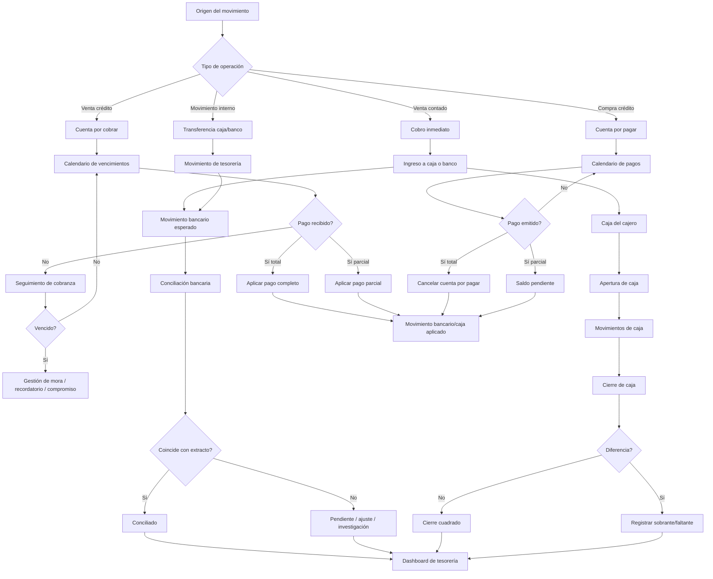

# Nexora — Plan detallado del Core de Tesorería y Cobranza v1

## Resumen
- **Archivo objetivo:** `C:\Users\Hernan Ricardo\Documents\GitHub\Nexora\Nexora\plan\nexora-treasury-collections-core-plan.md`
- Aunque el pedido nació como “cobranza”, el alcance validado es más amplio: este nuevo módulo debe ser un **core complementario de tesorería + cobranza**.
- El core debe funcionar **solo** cuando ningún otro core esté activo, pero si `inventory`, `human_resources`, `garage_operations`, `dental_core` u otros cores de negocio están encendidos, debe integrarse con ellos sin romper su autonomía.
- El flujo debe cubrir:
  - **cuentas por cobrar** (ventas retail, mayorista, servicios, cuotas, crédito),
  - **cuentas por pagar** (compras a crédito y obligaciones operativas),
  - **caja** (apertura, movimientos, cierre, diferencias),
  - **bancos** (cuentas, transferencias, depósitos),
  - **conciliación bancaria**,
  - **aplicación de pagos**,
  - **cobranzas vencidas**,
  - **insumos para nómina y tesorería de RRHH**.
- **Decisión de arquitectura:** no reutilizar `financial_core` personal como base del módulo, porque hoy está modelado por `user_id` y período individual; este core nuevo debe ser **operativo/comercial por tenant**.

## Flujo investigado y modelo operativo recomendado
La investigación converge en un patrón consistente para establecimientos comerciales con venta de productos y servicios:

1. **Venta / obligación originadora**
   - contado: genera cobro inmediato;
   - crédito: genera documento por cobrar;
   - compra a crédito: genera documento por pagar.
2. **Documento financiero**
   - factura de venta, boleta, nota de cargo, cuota, factura de compra, nota de crédito/débito.
3. **Condiciones**
   - contado / crédito / cuotas / vencimiento / descuento por pronto pago / mora.
4. **Recaudación o pago**
   - efectivo, transferencia, tarjeta, cheque, depósito, ajuste.
5. **Aplicación**
   - pago total, parcial, múltiple o anticipado sobre uno o varios documentos.
6. **Caja y bancos**
   - todo cobro/pago entra a caja o banco; si parte en caja y luego se deposita, eso debe quedar trazado.
7. **Conciliación**
   - el extracto bancario NO reemplaza al sistema; se reconcilia contra movimientos internos.
8. **Gestión de mora**
   - vencimientos, recordatorios, compromisos de pago, bloqueo comercial opcional.
9. **Integración modular**
   - inventario aporta compras/facturas/traspasos con crédito;
   - taller y dental aportan ventas, cobros y cuotas;
   - RRHH consume posición de caja/tesorería para programar pagos y eventualmente descuentos/autorizaciones.

### Flowchart propuesto

## Cambios de dominio, BD e interfaces

### 1) Posicionamiento del módulo
- **Nombre funcional recomendado:** `treasury_collections`
- **Razonamiento:** “cobranza” sola queda chica para lo que pediste; este core debe cubrir **CxC + CxP + caja + bancos + conciliación**.
- **Relación con otros cores:**
  - `inventory`: proveedor, compra a crédito, factura de compra, traspasos, notas de ajuste.
  - `garage_operations`: órdenes de trabajo, pagos, saldos, cuentas cliente.
  - `dental_core`: charges, installments, payments, overdue.
  - `human_resources`: calendario de caja/bancos, programación de egresos, disponibilidad para nómina.

### 2) Nuevas tablas del core

#### Maestros financieros
- `financial_counterparties`
  - tercero comercial unificado: cliente, proveedor, ambos.
  - `id`, `counterparty_type`, `customer_id`, `supplier_id`, `name_snapshot`, `document_type`, `document_number`, `phone`, `email`, `status`
- `financial_payment_terms`
  - `id`, `code`, `name`, `term_type` (`cash`, `credit`, `installments`), `days_due`, `installments_count`, `grace_days`, `late_fee_mode`, `status`
- `financial_document_sequences`
  - correlativos internos por tipo documental y tenant.

#### Caja y bancos
- `cash_registers`
  - caja física/lógica por sucursal o punto de atención.
  - `id`, `code`, `name`, `location`, `status`
- `cash_sessions`
  - apertura y cierre por cajero.
  - `id`, `cash_register_id`, `employee_id`, `opened_at`, `opening_amount`, `closed_at`, `expected_amount`, `counted_amount`, `difference_amount`, `status`
- `cash_movements`
  - `id`, `cash_session_id`, `movement_type` (`sale_in`, `payment_out`, `deposit_out`, `withdrawal_out`, `adjustment_in`, `adjustment_out`), `reference_table`, `reference_id`, `amount`, `currency`, `notes`, `created_by`
- `bank_accounts`
  - `id`, `bank_name`, `account_name`, `account_number_masked`, `currency`, `branch_name`, `status`
- `bank_movements`
  - `id`, `bank_account_id`, `movement_type`, `movement_date`, `reference_table`, `reference_id`, `amount`, `description`, `reconciliation_status`
- `bank_reconciliations`
  - `id`, `bank_account_id`, `statement_date_from`, `statement_date_to`, `statement_ending_balance`, `book_balance`, `difference_amount`, `status`
- `bank_reconciliation_lines`
  - `id`, `reconciliation_id`, `bank_movement_id`, `statement_reference`, `statement_amount`, `matched_flag`, `match_type`, `notes`

#### Cuentas por cobrar y por pagar
- `financial_documents`
  - documento financiero común.
  - `id`, `document_type` (`sale_invoice`, `sale_note`, `purchase_invoice`, `debit_note`, `credit_note`, `installment_plan`, `internal_charge`), `internal_number`, `external_number`, `counterparty_id`, `origin_core`, `origin_table`, `origin_id`, `issue_date`, `due_date`, `currency`, `subtotal`, `tax_total`, `discount_total`, `total_amount`, `balance_amount`, `document_status`, `direction` (`receivable`, `payable`)
- `financial_document_lines`
  - snapshots de líneas cuando el documento nace dentro del core o se replica desde otro.
- `financial_installments`
  - cuotas por documento.
  - `id`, `financial_document_id`, `installment_number`, `due_date`, `amount`, `balance_amount`, `status`
- `financial_receipts`
  - cabecera de cobranza recibida.
  - `id`, `receipt_number`, `counterparty_id`, `receipt_date`, `cash_session_id`, `bank_account_id`, `payment_method`, `total_amount`, `status`
- `financial_receipt_applications`
  - aplicación de cobros a documentos/cuotas.
  - `id`, `receipt_id`, `financial_document_id`, `installment_id`, `applied_amount`
- `financial_disbursements`
  - cabecera de pago emitido.
  - `id`, `disbursement_number`, `counterparty_id`, `payment_date`, `cash_session_id`, `bank_account_id`, `payment_method`, `total_amount`, `status`
- `financial_disbursement_applications`
  - aplicación de pagos a cuentas por pagar.

  #### Gestión de cobranza
- `collections_cases`
  - caso abierto por mora o seguimiento.
  - `id`, `financial_document_id`, `installment_id`, `case_status`, `days_past_due`, `priority`, `assigned_to`, `last_contact_at`
- `collections_actions`
  - `id`, `case_id`, `action_type` (`reminder`, `call`, `email`, `promise_to_pay`, `dispute`, `block`, `note`), `action_date`, `result`, `next_action_date`, `notes`
- `collections_promises`
  - promesas de pago y cumplimiento.

#### Integración con RRHH
- `treasury_payroll_reservations`
  - reserva o programación de egresos de nómina cuando RRHH esté activo.
- `cashier_shift_policies`
  - define si un cajero debe abrir/cerrar caja según turno laboral vinculado a RRHH.

### 3) Reglas funcionales clave
- **Retail contado:** genera cobro inmediato, asiento de caja/banco, sin CxC abierta.
- **Retail/Mayorista crédito:** genera documento `receivable` con vencimiento y opcionalmente cuotas.
- **Compra crédito:** genera documento `payable`, normalmente desde inventario.
- **Pago parcial:** nunca altera el total original; reduce solo `balance_amount`.
- **Notas de crédito/débito:** ajustan saldo, no sobrescriben historial.
- **Caja:** ningún cajero cobra sin sesión abierta.
- **Cierre de caja:** siempre calcula `expected_amount` vs `counted_amount`.
- **Conciliación:** se reconcilia por línea, no solo por total.
- **Integración opcional:** si un core origen está apagado, el módulo debe permitir alta manual del documento base.

### 4) Endpoints sugeridos
#### Caja
- `POST /treasury/cash-registers/:id/open-session`
- `POST /treasury/cash-sessions/:id/close`
- `GET /treasury/cash-sessions/:id`
- `POST /treasury/cash-sessions/:id/movements`

#### Bancos y conciliación
- `GET /treasury/bank-accounts`
- `POST /treasury/bank-accounts`
- `GET /treasury/bank-accounts/:id/movements`
- `POST /treasury/bank-reconciliations`
- `POST /treasury/bank-reconciliations/:id/match-line`
- `POST /treasury/bank-reconciliations/:id/close`

#### Cuentas por cobrar / pagar
- `GET /treasury/documents`
- `POST /treasury/documents`
- `GET /treasury/documents/:id`
- `POST /treasury/documents/:id/installments`
- `POST /treasury/receipts`
- `POST /treasury/disbursements`
- `POST /treasury/receipts/:id/apply`
- `POST /treasury/disbursements/:id/apply`

#### Cobranza
- `GET /treasury/collections/cases`
- `POST /treasury/collections/cases/:id/actions`
- `POST /treasury/collections/cases/:id/promise-to-pay`
- `POST /treasury/collections/cases/:id/close`

### 5) Pantallas mínimas
- Dashboard de tesorería
- Cuentas por cobrar
- Cuentas por pagar
- Caja / apertura y cierre
- Bancos
- Conciliación bancaria
- Recibos / pagos aplicados
- Casos de cobranza y mora
- Reporte de flujo por core origen
- Integración con nómina cuando RRHH esté activo

## Frontend recomendado
- **NO modal chico** para caja, conciliación ni aplicación de cobros/pagos.
- Usar **pantallas master-detail** con filtros fuertes:
  - por estado,
  - vencimiento,
  - caja,
  - banco,
  - cajero,
  - core origen.
- Patrones Nexora observados a reutilizar:
  - `view -> store -> service -> controller`
  - `Pinia`
  - vistas por módulo
  - pantallas completas para flujos operativos, no solo formularios livianos.
- UX específica:
  - apertura de caja en 1 paso;
  - cierre con resumen esperado vs contado;
  - conciliación con grilla doble “sistema vs extracto”;
  - cobranzas con cola por prioridad y días de mora.

## Integración modular
- Si `treasury_collections = off`, los cores actuales siguen como hoy.
- Si `treasury_collections = on`:
  - `inventory` entrega documentos `payable/receivable` cuando existan compras o traslados con crédito.
  - `garage_operations` debe dejar de depender solo de `work_order_payments` y pasar a consumir recibos/aplicaciones del core.
  - `dental_core` debe poder enrutar `charges`, `payments` e `installments` al core central, aunque mantenga sus vistas clínicas.
  - `human_resources` puede consultar:
    - saldo de caja,
    - saldo bancario conciliado,
    - pagos programados,
    - reservas de nómina.
- **Tradeoff explícito:**
  - centralizar tesorería mejora trazabilidad y reporting;
  - exige adaptadores para garage/dental/inventory en lugar de seguir con tablas aisladas.

## Casos de prueba
- venta contado retail y cierre correcto de caja
- venta crédito mayorista con vencimiento
- pago parcial aplicado a factura por cobrar
- compra a crédito nacida desde inventario
- pago parcial de factura por pagar
- apertura de caja por cajero y cierre con diferencia cero
- cierre con sobrante/faltante
- depósito bancario desde caja
- conciliación bancaria con match exacto
- conciliación con diferencia por movimiento faltante
- nota de crédito que reduce saldo de una cuenta por cobrar
- dental funcionando solo sin tesorería central
- dental integrado con tesorería central
- garage funcionando solo sin tesorería central
- garage integrado con tesorería central
- RRHH consultando posición de tesorería para nómina
- módulo funcionando manualmente sin inventory/RRHH/garage/dental encendidos

## Supuestos y defaults cerrados
- El nombre técnico recomendado del módulo es **`treasury_collections`**, no `collections_core`.
- Este core será **complementario**, no core obligatorio.
- El módulo cubre **CxC + CxP + caja + bancos + conciliación**, porque ese es el alcance real descrito.
- Se permite carga manual de documentos cuando el core origen no exista o esté apagado.
- La conciliación bancaria inicial será **manual asistida**, no automática OCR.
- El cierre de caja será por **sesión de cajero**, vinculado opcionalmente a RRHH si ese core está activo.
- El core de inventario sigue siendo dueño del documento logístico; tesorería es dueña del documento financiero derivado.
- Para mantener compatibilidad con Bluehost/PostgreSQL 10:
  - sin colas persistentes,
  - sin procesos residentes,
  - sin dependencias de OCR o integraciones bancarias obligatorias en v1.

## Investigación base utilizada
- La lógica de **accounts payable** y el patrón de validación contra orden/factura/recepción (three-way match) respaldan que el core incluya **CxP real** y no solo cobro: [Accounts payable](https://en.wikipedia.org/wiki/Accounts_payable)
- La **conciliación bancaria** exige comparar libros vs extracto y tratar diferencias por timing, errores o movimientos faltantes; eso justifica tablas separadas de conciliación y líneas conciliadas: [Bank reconciliation](https://en.wikipedia.org/wiki/Bank_reconciliation)
- El cierre de caja por cajero requiere comparar esperado vs contado, registrar diferencias y separar depósitos/float; eso respalda sesiones de caja y movimientos de caja: [Cashier balancing](https://en.wikipedia.org/wiki/Cashier_balancing)
- Para cobranzas avanzadas, la priorización de facturas vencidas y promesas de pago es una práctica valiosa para escalar la gestión de recaudo: [Optimize Cash Collection: Use Machine Learning to Predict Invoice Payment](https://arxiv.org/abs/1912.10828)